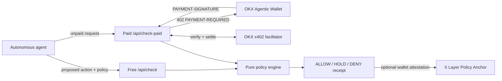

# TxSentinel Architecture

## System Boundary



TxSentinel is placed before signing. It receives only a proposed action, policy constraints, and optional simulation evidence. It never receives a private key and exposes no signing or transaction-submission method.

## Deterministic Receipt

The policy engine normalizes the action, sorts policy lists, evaluates rules in a fixed order, and hashes canonical JSON. The wall-clock `evaluatedAt` timestamp is added by the HTTP layer and excluded from the receipt, so equivalent normalized inputs produce the same `actionDigest` and `receiptHash`.

```text
actionDigest = SHA256(canonical(action + policy + evidence))
receiptHash  = SHA256(canonical(policyVersion + actionDigest + decision + reasons))
```

## Trust Model

| Input or component | Trust treatment |
| --- | --- |
| Agent request | Strict Zod schema, unknown fields rejected |
| Policy values | Finite non-negative bounds and capped arrays |
| Simulation evidence | Explicitly labeled as supplied evidence |
| Decision engine | Pure synchronous function, no network dependency |
| x402 payment | Verified and settled by the official OKX facilitator SDK |
| Wallet | Remains outside TxSentinel; only the wallet signs |

## Production Replacement Points

The current build evaluates caller-supplied simulation evidence. A production deployment should add an adapter before the policy engine for chain-native simulation and reputation data:

1. X Layer/EVM RPC `eth_call` and gas estimation.
2. Solana `simulateTransaction` with account and program metadata.
3. Contract verification and recipient reputation providers.
4. Signed organization policy documents with a policy ID registry.

These adapters enrich the `simulation` object; they do not alter the deterministic policy core.

## X Layer Policy Anchor

`TxSentinelPolicyAnchor.sol` is an optional evidence layer deployed from OKX Wallet. It has no
administrator, upgrade path, payable function, token transfer, signature authority, or external
contract call. Each wallet owns its own `policyKey` namespace, which prevents another account from
pre-registering or blocking a TxSentinel policy.

When a receipt is anchored, the contract stores an immutable snapshot of:

- action digest and deterministic receipt hash
- policy hash, version hash, and exact revision used at anchor time
- policy owner, authorized submitter, decision, and block timestamp

Delegates are granted per policy rather than per owner, following least privilege. Receipt
uniqueness is scoped by policy owner and policy key, so an unrelated account cannot grief another
owner by submitting the same public receipt hash first.

The anchor is an attestation. It proves who submitted which evidence and when; it does not claim the
EVM re-executed the offchain rules or authorized an asset transfer. A production enforcement path
can add a Safe module or ERC-4337 validator that checks an active, authorized receipt before wallet
execution.

### Pre-deployment review

- Solidity `0.8.24` semantics with checked arithmetic; optimized with 200 runs
- no loops, fallback, receive, assembly, `delegatecall`, `selfdestruct`, or external calls
- owner-scoped policy namespaces and policy-scoped revocable delegates
- immutable historical policy snapshots in every receipt
- duplicate anchors rejected within the same owner and policy namespace
- inactive policies fail closed
- compiler, Solhint, local EVM contract tests, API tests, and browser wallet-flow tests run before deployment

## x402 State

The official x402 server path is implemented in `api/check-paid.js`. It uses:

- `OKXFacilitatorClient`
- `x402ResourceServer`
- `ExactEvmScheme`
- `paymentMiddleware`

Without credentials it returns `503 X402_CONFIGURATION_REQUIRED`, while `GET /api/check-paid` publishes a machine-readable readiness report. With credentials, missing payment is handled by the official middleware and returns the protocol-standard HTTP 402 challenge.
