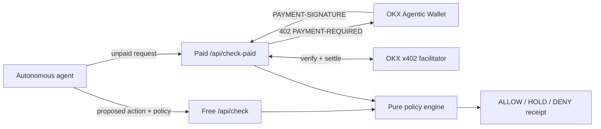

# TxSentinel Architecture

## System Boundary



TxSentinel is placed before signing. It receives only a proposed action, policy constraints, and optional simulation evidence. It never receives a private key and exposes no signing or transaction-submission method.

## Deterministic Receipt

The policy engine normalizes the action, sorts policy lists, evaluates rules in a fixed order, and hashes canonical JSON. The wall-clock `evaluatedAt` timestamp is added by the HTTP layer and excluded from the receipt, so equivalent normalized inputs produce the same `actionDigest` and `receiptHash`.

```text
actionDigest = SHA256(canonical(action + policy + evidence))
receiptHash  = SHA256(canonical(policyVersion + actionDigest + decision + reasons))
```

## Trust Model

| Input or component | Trust treatment |
| --- | --- |
| Agent request | Strict Zod schema, unknown fields rejected |
| Policy values | Finite non-negative bounds and capped arrays |
| Simulation evidence | Explicitly labeled as supplied evidence |
| Decision engine | Pure synchronous function, no network dependency |
| x402 payment | Verified and settled by the official OKX facilitator SDK |
| Wallet | Remains outside TxSentinel; only the wallet signs |

## Production Replacement Points

The current build evaluates caller-supplied simulation evidence. A production deployment should add an adapter before the policy engine for chain-native simulation and reputation data:

1. X Layer/EVM RPC `eth_call` and gas estimation.
2. Solana `simulateTransaction` with account and program metadata.
3. Contract verification and recipient reputation providers.
4. Signed organization policy documents with a policy ID registry.

These adapters enrich the `simulation` object; they do not alter the deterministic policy core.

## x402 State

The official x402 server path is implemented in `api/check-paid.js`. It uses:

- `OKXFacilitatorClient`
- `x402ResourceServer`
- `ExactEvmScheme`
- `paymentMiddleware`

Without credentials it returns `503 X402_CONFIGURATION_REQUIRED`, while `GET /api/check-paid` publishes a machine-readable readiness report. With credentials, missing payment is handled by the official middleware and returns the protocol-standard HTTP 402 challenge.
