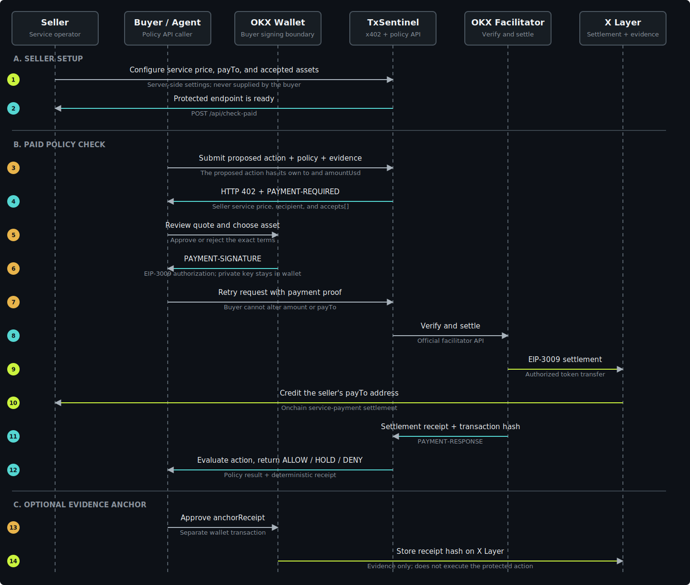

<p align="right"><strong>English</strong> · <a href="README.zh-CN.md">简体中文</a></p>

# 🛡️ TxSentinel

> A deterministic transaction policy firewall for autonomous agents.

Before an agent signs an onchain action, TxSentinel evaluates its intent, policy limits, and supplied
simulation evidence. Free preflight returns coarse readiness for routing; the formal x402 service
returns an explainable `ALLOW`, `HOLD`, or `DENY` receipt after settlement. Neither path takes custody,
signs the protected action, or broadcasts it.

## 🔗 Quick Links

| Experience | Link | Purpose |
| --- | --- | --- |
| 🚀 Live product | [Open TxSentinel](https://txsentinel-okx.vercel.app) | Product overview and guided workflow |
| 🧪 Free preflight | [Preflight an action](https://txsentinel-okx.vercel.app/evaluate.html) | Test non-binding `READY`, `REVIEW`, and `BLOCKED` readiness |
| ⛓️ Onchain console | [Verify on X Layer](https://txsentinel-okx.vercel.app/onchain.html) | Register a policy and anchor a paid formal receipt |
| 🔌 Integration guide | [Integrate an agent](https://txsentinel-okx.vercel.app/integrate.html) | Connect an agent or wallet workflow |
| 📡 Free preflight API | [`POST /api/preflight`](https://txsentinel-okx.vercel.app/api/preflight) | Coarse readiness without formal evidence or receipt hashes |

**Project status:** ASP candidate `TxSentinel #6828` · Listing review submitted<br>
**Built for:** OKX.AI Genesis Hackathon

## 📚 Documentation

- [Visual product guide](docs/VISUAL_GUIDE.md)
- [Architecture and trust boundaries](ARCHITECTURE.md)
- [API contract](docs/API.md)
- [Project provenance and attribution](NOTICE.md)
- [Buyer and seller model](#buyer-seller-and-the-protected-action)
- [End-to-end x402 interaction](#end-to-end-x402-interaction)
- [Policy FAQ](#policy-faq)

## 🗺️ Product in One Picture


1. An agent constructs an action and runs a free, non-binding preflight before wallet signing.
2. Preflight returns only `READY`, `REVIEW`, or `BLOCKED` for routing.
3. A valid formal request crosses the OKX x402 payment gate and returns `ALLOW`, `HOLD`, or `DENY`
   with deterministic evidence.
4. The wallet may separately execute an allowed action or anchor the paid receipt to X Layer.

## ⛓️ What Is Onchain?


`registerPolicy` does not approve tokens or move funds. It binds a wallet to a policy hash and
revision. `anchorReceipt` stores evidence of a decision; it does not execute the underlying action.

## 🎯 Why It Exists

Agent wallets make autonomous actions possible, but autonomy without a pre-sign policy boundary is unsafe. Most transaction simulators answer whether a transaction *can* execute. TxSentinel answers whether the agent *should* execute it under a specific mandate.

Every **formal paid decision** contains:

- a normalized action and immutable policy snapshot
- structured rule evidence and a deterministic risk score
- an action digest and SHA-256 receipt hash
- no private keys, signing authority, or broadcast capability

## ⚡ Try It

```bash
curl -sS https://txsentinel-okx.vercel.app/api/preflight \
  -H 'Content-Type: application/json' \
  -d '{
    "chain":"xlayer",
    "operation":"transfer",
    "to":"0x4a6aae28b27681856ae824af82fea87896ecc3ed",
    "amountUsd":25,
    "policy":{"maxSpendUsd":100,"requireSimulation":true},
    "simulation":{"status":"succeeded","estimatedFeeUsd":0.01}
  }'
```

The free response contains only `READY`, `REVIEW`, or `BLOCKED`, a next action, and explicit
limitations. It applies a lightweight readiness subset and does not expose the formal decision,
risk score, reason evidence, `actionDigest`, or `receiptHash`. `READY` is not equivalent to `ALLOW`:
the formal route still evaluates recipient lists, contract verification, slippage, fees, and the
complete normalized policy. The legacy `/api/check` URL remains a deprecated alias so the submitted
ASP review link does not break.

## 🚦 Formal Decision Model

| Decision | Meaning | Representative rules |
| --- | --- | --- |
| `ALLOW` | Every supplied constraint passes | Safe transfer inside spend and fee limits |
| `HOLD` | Human or upstream evidence is required | Spend cap, allowlist, simulation, contract, slippage, fee |
| `DENY` | The action violates a hard boundary | Unsupported chain, blocked recipient, revert, unlimited approval |

Supported chains are X Layer, Ethereum, Base, and Solana. Supported operations are transfer, swap, token approval, and contract call.

## 👤 Policy Ownership

| Layer | Controlled by | Examples |
| --- | --- | --- |
| User policy | Policy owner | Spend cap, recipient lists, simulation requirement, slippage and fee limits |
| System safety rails | TxSentinel | Strict schema, supported operations, non-negative values, deterministic normalization |
| Onchain snapshot | X Layer contract | Owner, policy hash, version, revision, active status, anchored receipts |

The current onchain demo registers a reviewed canonical Policy v1. A later policy update increments
the revision; receipts already anchored against an older revision do not change.

## 🔌 OKX Integration

TxSentinel uses two deliberately different product surfaces:

1. `POST /api/preflight` is a free, non-binding readiness screen. It applies only basic checks and
   returns `READY`, `REVIEW`, or `BLOCKED`; it never issues formal evidence or receipt hashes.
2. `POST /api/check-paid` is the formal policy product. It returns `ALLOW`, `HOLD`, or `DENY`,
   detailed rule evidence, risk score, stable hashes, and the x402 settlement receipt.

The paid route validates and deterministically precomputes the request **before** the x402 middleware.
Malformed input returns HTTP `422` without a payment challenge. A valid unpaid request receives HTTP
`402` with `PAYMENT-REQUIRED`; OKX Wallet signs, retries with `PAYMENT-SIGNATURE`, and receives the
formal result plus `PAYMENT-RESPONSE` after settlement.

See [ARCHITECTURE.md](ARCHITECTURE.md) for the exact trust boundary and [docs/API.md](docs/API.md) for the request contract.

<a id="buyer-seller-and-the-protected-action"></a>

## 💱 Buyer, Seller, and the Protected Action


Two different values travel through the paid endpoint and must not be confused:

1. **x402 service payment:** the fee for calling TxSentinel's metered policy API. The seller controls its price, receiving address, and accepted assets.
2. **Protected action:** the transaction proposal being evaluated. The buyer's agent supplies fields such as `to` and `amountUsd`, while the user's policy determines whether that action is allowed.

### Who controls each value?

| Value or decision | Controlled by | Buyer experience |
| --- | --- | --- |
| x402 service price | Seller, configured server-side | Reviews the quoted amount; cannot reduce it |
| x402 receiving address (`PAY_TO_ADDRESS`) | Seller, configured server-side | Verifies the recipient; cannot redirect it |
| Accepted payment assets | Seller advertises the supported set | Chooses one advertised asset: USD₮0, USDG, or USDC |
| Protected action `to` and `amountUsd` | Buyer, user, or authorized agent | Supplies the proposal before wallet signing |
| Policy limits | Policy owner | The agent cannot silently loosen them |
| Payment authorization | Buyer wallet | Explicitly approves or rejects every payment |
| Policy result and receipt | TxSentinel | Receives deterministic `ALLOW`, `HOLD`, or `DENY` evidence |

### Seller operation

1. Configure facilitator credentials, `X402_PRICE`, `PAY_TO_ADDRESS`, and accepted assets on the server.
2. Expose the protected endpoint. TxSentinel returns those server-controlled terms in a standard HTTP 402 challenge.
3. Receive settlement only after the buyer approves the exact terms, then return the paid policy result and receipt.

The current live deployment is a **single-seller implementation**: TxSentinel is the seller and its
settings are deployment environment variables. A production multi-seller version would add a
wallet-verified seller dashboard and load price, recipient, and assets from a server-side `sellerId`
profile. It would not make these fields editable by the buyer.

### Buyer operation

1. The agent calls free preflight and receives coarse readiness without formal receipt material.
2. If a formal report is needed, the agent submits the same proposal to the paid route. Invalid input
   stops before payment; valid input receives the seller's server-issued terms.
3. The buyer chooses one accepted token, reviews the amount and recipient, and explicitly approves
   the EIP-3009 authorization in OKX Wallet.
4. After settlement, the buyer receives the formal policy decision, detailed evidence, deterministic
   hashes, and a verifiable payment receipt.

This separation prevents a buyer from changing the fee to zero or redirecting it to another address,
while still allowing the buyer or agent to define the transaction that TxSentinel evaluates.

<a id="end-to-end-x402-interaction"></a>

### End-to-End x402 Interaction



- **Steps 1–2:** the seller configures the service and publishes free preflight plus the formal route.
- **Steps 3–4:** preflight returns coarse readiness without wallet use, formal evidence, or hashes.
- **Steps 5–15:** the paid route validates and precomputes offchain before issuing a 402; the buyer
  then authorizes settlement and receives the formal decision and deterministic receipt.
- **Steps 12–13:** the service payment settles on X Layer to the seller-controlled `payTo` address.
- **Steps 16–17:** the buyer may separately anchor the paid policy receipt hash on X Layer. This optional
  evidence transaction does not execute the protected action and does not give TxSentinel custody.

The protected action itself remains a proposal. An `ALLOW` result permits the buyer's wallet or
agent workflow to continue, but TxSentinel never signs or broadcasts that action.

## 🧑‍💻 Local Development

```bash
npm install
npm test
npm run check
npx vercel@53.4.0 dev --listen 8791
npm run smoke
```

The test suite covers policy boundaries, preflight information limits, receipt determinism,
prepayment rejection, and HTTP behavior. The smoke suite exercises all three coarse preflight
states and verifies the x402 readiness state.

## 💳 Official x402 Activation

```bash
cp .env.example .env.local
# Fill OKX_API_KEY, OKX_SECRET_KEY, OKX_PASSPHRASE and PAY_TO_ADDRESS
npx vercel@53.4.0 env add OKX_API_KEY production
npx vercel@53.4.0 env add OKX_SECRET_KEY production
npx vercel@53.4.0 env add OKX_PASSPHRASE production
npx vercel@53.4.0 env add PAY_TO_ADDRESS production
```

The endpoint advertises three explicit choices in one standard `accepts[]` challenge: test USD₮0, test USDG, and test USDC on X Layer Testnet (`eip155:1952`). All three assets are distributed by the official X Layer faucet, and every payment requires a fresh, explicit wallet confirmation.

| Test asset | Contract | EIP-712 domain | Decimals |
| --- | --- | --- | ---: |
| USD₮0 | [`0x9e29…fb0c`](https://web3.okx.com/explorer/x-layer-testnet/address/0x9e29b3aada05bf2d2c827af80bd28dc0b9b4fb0c) | `USD₮0` / `1` | 6 |
| USDG | [`0xa78e…eec1`](https://web3.okx.com/explorer/x-layer-testnet/address/0xa78e2baabaf5c4f36b7fc394725deb68d332eec1) | `Global Dollar` / `1` | 6 |
| USDC | [`0xcb8b…c79d`](https://web3.okx.com/explorer/x-layer-testnet/address/0xcb8bf24c6ce16ad21d707c9505421a17f2bec79d) | `USDC_TEST` / `2` | 6 |

The addresses were verified from the [official faucet contract's outgoing token transfers](https://web3.okx.com/explorer/x-layer-testnet/address/0xf6d088123a3c17e6047ae9338b8cf072ad448907), not inferred from wallet holdings.

### Settlement readiness

| Requirement | Status |
| --- | --- |
| Official OKX x402 middleware and EVM scheme | ✅ Implemented |
| Public paid endpoint | ✅ Deployed at [`/api/check-paid`](https://txsentinel-okx.vercel.app/api/check-paid) |
| X Layer Testnet configuration (`eip155:1952`) | ✅ Implemented |
| X Layer Testnet USD₮0, USDG, and USDC options (`eip155:1952`) | ✅ Implemented |
| OKX Developer Portal API credentials in Vercel | ✅ Configured as encrypted production variables |
| EVM receiving address in `PAY_TO_ADDRESS` | ✅ Present in the live 402 challenge |
| Browser buyer flow with OKX Wallet | ✅ Live on [`/integrate.html`](https://txsentinel-okx.vercel.app/integrate.html) |
| Buyer wallet funded with X Layer Testnet assets | ✅ Ready |
| Settled transaction hash and onchain transfer evidence | ✅ [Verified live settlement](https://www.okx.com/web3/explorer/xlayer-test/tx/0x78865316d773400a223c0e76aced95c25def2fba3f0335b79ba64ff70354f68d) |

### Verified live x402 settlement

On July 21, 2026 at 02:57:54 UTC, the browser buyer flow completed a real test settlement through
the official x402 path. The facilitator relayed an EIP-3009 `transferWithAuthorization` call, so the
top-level transaction sender is the facilitator relayer while the token event proves the authorized
buyer-to-seller transfer.

| Field | Verified value |
| --- | --- |
| Network | X Layer Testnet, chain ID `1952` |
| Transaction | [`0x78865316…f70354f68d`](https://www.okx.com/web3/explorer/xlayer-test/tx/0x78865316d773400a223c0e76aced95c25def2fba3f0335b79ba64ff70354f68d) |
| Status / block | Success / `36143837` |
| Asset | test USD₮0, [`0x9e29…fb0c`](https://web3.okx.com/explorer/x-layer-testnet/address/0x9e29b3aada05bf2d2c827af80bd28dc0b9b4fb0c) |
| Amount | `10,000` atomic units = `0.01` test USD₮0 |
| Authorized buyer | `0x0934146ca4f8e611da0ef8bd295ee9f7e34741fe` |
| Seller / `payTo` | `0x4a6aae28b27681856ae824af82fea87896ecc3ed` |
| Facilitator relayer | `0x40817a0d9043732d48823c05ab2ffb643ef8d90a` |

The asset, amount, network, and recipient exactly match the live `PAYMENT-REQUIRED` challenge from
`POST /api/check-paid`. See the [reproducible evidence record](./EVIDENCE.md) for the verification method.

Open the live settlement lab on `/integrate.html` to run the documented
`402 → select asset → check balance → sign → retry → settle` flow with OKX Wallet. The page
checks the balance of the selected token and network before enabling the explicit payment confirmation. See the
[official OKX seller SDK guide](https://web3.okx.com/zh-hans/onchainos/dev-docs/payments/service-seller-sdk) and [X Layer faucet](https://web3.okx.com/xlayer/faucet/xlayerfaucet).

## 🔗 X Layer Receipt Anchor

The optional `TxSentinelPolicyAnchor` contract stores immutable policy-version snapshots and
deterministic receipt hashes. Open `/onchain.html` to connect OKX Wallet, verify the canonical X
Layer Testnet deployment, register policy v1, load the latest paid x402 receipt from the same browser,
and anchor its hashes.
The contract cannot hold or transfer assets and does not receive signing authority.

- Canonical X Layer Testnet contract: [`0x295975cbec1673061d11c223b35a8513d1ebb213`](https://www.okx.com/web3/explorer/xlayer-test/address/0x295975cbec1673061d11c223b35a8513d1ebb213)
- Deployment transaction: [`0x6604803f...741ae9`](https://www.okx.com/web3/explorer/xlayer-test/tx/0x6604803fda9b0b298ed18ea1e3e9dfc4b58b05e0f2989652f64500e8aa741ae9)
- Runtime bytecode hash: `0xd81838ab32626c1956fe06fb9551718b0b40b16ad54079dba38612e811c3c763`

```bash
npm run contract:compile
npm run contract:lint
npm run contract:test
```

<a id="policy-faq"></a>

## ❓ Policy FAQ

### 1. Can one wallet own multiple policies?

**Yes.** Policies are stored under `(owner address, policyKey)`, so one wallet can register multiple
independent policies by using different policy keys. Each policy has its own ruleset hash, version,
revision, active status, delegates, and receipt history. Different wallets may also reuse the same
application-defined policy key because each owner's namespace is isolated.

### 2. Can a policy be updated?

**Yes.** The policy owner can call `updatePolicy` with a replacement policy hash and version hash. The
contract increments the policy revision on every update. Updating an inactive policy does not
automatically reactivate it.

Previously anchored receipts remain unchanged after an update. Every receipt stores the policy
hash, version hash, and revision that were active when that decision was anchored, preserving an
auditable historical snapshot.

### 3. Who can update or disable a policy?

Only the wallet that owns the policy can update it, change its active status, or manage delegates.
A policy-scoped delegate may anchor receipts for that policy but cannot change its rules or status.

### 4. Does a policy expire automatically?

**No.** The current contract has no automatic expiration timestamp. A registered policy remains active
until its owner calls `setPolicyActive(policyKey, false)`. The owner may later reactivate it with
`setPolicyActive(policyKey, true)`.

### 5. Can a policy be deleted or registered again under the same key?

**No.** Onchain policy records are not deleted, and an existing `(owner, policyKey)` cannot be registered
again. The owner should update the existing policy, deactivate it, or register a new policy under a
different key. This prevents historical receipts from losing their policy identity.

### 6. Does the current web console expose all of these controls?

**Not yet.** The deployed contract supports multiple policies, updates, activation controls, and
policy-scoped delegates. The current hackathon console intentionally presents one reviewed canonical
Policy v1 so the end-to-end registration and receipt flow stays easy to verify.

## 🔒 Security

TxSentinel is read-only. It rejects unknown top-level and policy fields before payment, caps request
size on the paid endpoint, never accepts a private key field, and cannot sign or broadcast
transactions. Free preflight never returns formal evidence or receipt hashes. Supplied simulation
evidence is labeled as evidence, not represented as an RPC simulation performed by TxSentinel.

## 🗂️ Repository Map

```text
api/preflight.js      Free, non-binding readiness endpoint
api/check.js          Deprecated preflight alias for ASP link compatibility
api/check-paid.js     Formal OKX x402 policy endpoint with prepayment validation
lib/preflight.js      Coarse response and information boundary
lib/policy.js         Pure policy and receipt engine
public/               Overview, four-step evaluator, onchain console, and integration guide
contracts/            Non-custodial X Layer policy receipt anchor
scripts/smoke.mjs     Deployment smoke suite
test/                 Policy and HTTP contract tests
```

## ✅ Status

- ✅ Free preflight and formal paid API separation: complete
- ✅ ASP `#6828` activation and listing review: submitted
- ✅ Official x402 server integration: implemented
- ✅ x402 seller configuration: facilitator credentials and `PAY_TO_ADDRESS` are live
- ✅ Browser buyer flow: quote, OKX Wallet connection, balance check, signing, retry, and receipt rendering are implemented
- ✅ Real x402 settlement proof: [buyer-confirmed and verified on X Layer Testnet](https://www.okx.com/web3/explorer/xlayer-test/tx/0x78865316d773400a223c0e76aced95c25def2fba3f0335b79ba64ff70354f68d)
