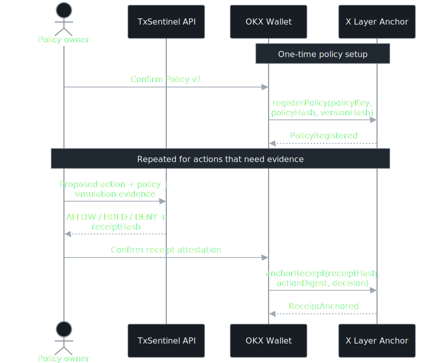
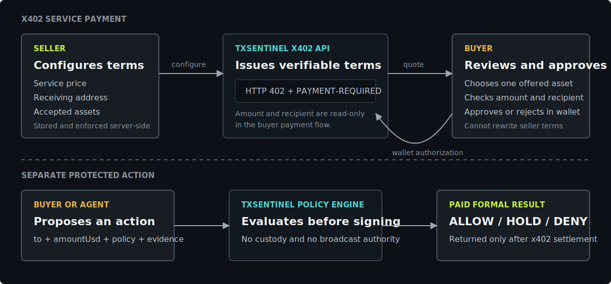

<p align="right"><a href="README.md">English</a> · <strong>简体中文</strong></p>

# 🛡️ TxSentinel

> 面向自主智能体的确定性交易策略防火墙。

在智能体签署链上操作之前，TxSentinel 会评估操作意图、策略限制和外部提供的模拟证据，
并生成可解释的 `ALLOW`、`HOLD` 或 `DENY` 决策凭证。TxSentinel 不托管资产、不签署交易，
也不负责广播交易。

## 🔗 快速入口

| 功能 | 链接 | 用途 |
| --- | --- | --- |
| 🚀 在线产品 | [打开 TxSentinel](https://txsentinel-okx.vercel.app) | 查看产品概览和引导式工作流 |
| 🧪 策略评估器 | [评估链上操作](https://txsentinel-okx.vercel.app/evaluate.html) | 测试 `ALLOW`、`HOLD` 和 `DENY` 决策 |
| ⛓️ 链上控制台 | [在 X Layer 上验证](https://txsentinel-okx.vercel.app/onchain.html) | 注册策略并锚定决策凭证 |
| 🔌 集成指南 | [接入智能体](https://txsentinel-okx.vercel.app/integrate.html) | 接入智能体或钱包工作流 |
| 📡 免费审核 API | [`POST /api/check`](https://txsentinel-okx.vercel.app/api/check) | 确定性的公开策略评估接口 |

**项目状态：** ASP 候选服务 `TxSentinel #6828` · 已提交上架审核<br>
**参赛项目：** OKX.AI Genesis Hackathon

## 📚 项目文档

- [可视化产品指南](docs/VISUAL_GUIDE.md)
- [架构与信任边界](ARCHITECTURE.md)
- [API 协议](docs/API.md)
- [买方、卖方与被检查交易](#buyer-seller-zh)
- [策略常见问题](#policy-faq-zh)

## 🗺️ 一张图看懂产品



1. 智能体构造一笔链上操作。
2. TxSentinel 在操作被签名之前执行策略检查。
3. 策略引擎返回 `ALLOW`、`HOLD` 或 `DENY`，并生成确定性证据。
4. 钱包可以将凭证锚定到 X Layer，同时不向合约授予资产托管权或交易执行权。

## ⛓️ 哪些内容会上链？



`registerPolicy` 不会授权代币，也不会转移资产。它只会把钱包地址与策略哈希和版本绑定。
`anchorReceipt` 只保存决策证据，不会执行被评估的链上操作。

## 🎯 为什么需要 TxSentinel？

智能体钱包让自动执行链上操作成为可能，但缺少签名前策略边界的自动化是不安全的。
大多数交易模拟器回答的是一笔交易“能否执行”，TxSentinel 回答的是智能体在特定授权范围内
“是否应该执行”这笔交易。

每一份决策结果都包含：

- 标准化后的操作和不可变的策略快照
- 结构化规则证据和确定性风险分数
- 操作摘要和 SHA-256 凭证哈希
- 不包含私钥、签名权限或交易广播能力

## ⚡ 快速体验

```bash
curl -sS https://txsentinel-okx.vercel.app/api/check \
  -H 'Content-Type: application/json' \
  -d '{
    "chain":"xlayer",
    "operation":"transfer",
    "to":"0x4a6aae28b27681856ae824af82fea87896ecc3ed",
    "amountUsd":25,
    "policy":{"maxSpendUsd":100,"requireSimulation":true},
    "simulation":{"status":"succeeded","estimatedFeeUsd":0.01}
  }'
```

该接口也接受空的 POST 请求，并返回一个有文档说明的审核示例，方便市场审核人员直接验证服务可用性。

## 🚦 决策模型

| 决策 | 含义 | 典型规则 |
| --- | --- | --- |
| `ALLOW` | 所有约束均通过 | 转账金额和手续费均在限制范围内 |
| `HOLD` | 需要人工确认或补充上游证据 | 金额上限、白名单、模拟、合约、滑点、手续费 |
| `DENY` | 操作违反硬性安全边界 | 不支持的网络、黑名单地址、执行回滚、无限授权 |

当前支持 X Layer、Ethereum、Base 和 Solana；支持转账、兑换、代币授权和合约调用。

## 👤 策略归属

| 层级 | 控制方 | 示例 |
| --- | --- | --- |
| 用户策略 | 策略所有者 | 支出上限、地址名单、模拟要求、滑点和手续费限制 |
| 系统安全边界 | TxSentinel | 严格数据结构、支持的操作、非负数检查、确定性标准化 |
| 链上快照 | X Layer 合约 | 所有者、策略哈希、版本、修订号、启用状态和凭证 |

当前链上演示会注册经过审核的标准 Policy v1。更新策略时修订号会递增，已经按旧版本锚定的
凭证不会被后续更新改变。

## 🔌 OKX 集成

TxSentinel 将免费审核和付费服务隔离为两个独立入口：

1. `POST /api/check` 是稳定开放的免费 ASP 审核接口。
2. `POST /api/check-paid` 使用官方 `@okxweb3/x402-express`、`@okxweb3/x402-core` 和
   `@okxweb3/x402-evm`。只有配置 facilitator 凭证和收款地址后才会启用收费。

启用后，未付款请求会收到 HTTP `402` 和 `PAYMENT-REQUIRED`。OKX Agentic Wallet 完成签名后，
携带 `PAYMENT-SIGNATURE` 重试请求；结算完成后，服务返回策略结果和 `PAYMENT-RESPONSE`。

完整信任边界见 [ARCHITECTURE.md](ARCHITECTURE.md)，请求格式见 [docs/API.md](docs/API.md)。

<a id="buyer-seller-zh"></a>

## 💱 买方、卖方与被检查交易



付费接口中会同时出现两类金额，不能混为一谈：

1. **x402 服务费：** 调用 TxSentinel 付费策略接口的费用。价格、收款地址和可接受币种由卖方控制。
2. **被检查交易：** 智能体希望执行的交易提案。买方智能体提交 `to`、`amountUsd` 等字段，用户 Policy 决定这笔交易是否可以继续。

### 每项内容由谁控制？

| 内容 | 控制方 | 买方操作 |
| --- | --- | --- |
| x402 服务价格 | 卖方在服务端配置 | 查看报价，但不能调低价格 |
| x402 收款地址（`PAY_TO_ADDRESS`） | 卖方在服务端配置 | 核对收款人，但不能重定向 |
| 可接受支付币种 | 卖方公布支持列表 | 从 USD₮0、USDG、USDC 中选择一种 |
| 被检查交易的 `to`、`amountUsd` | 买方、用户或获授权智能体 | 在钱包签名前提交交易提案 |
| Policy 限制 | Policy 所有者 | 智能体不能自行放宽规则 |
| 支付授权 | 买方钱包 | 每次支付都明确批准或拒绝 |
| 策略结果与凭证 | TxSentinel | 获得确定性的 `ALLOW`、`HOLD` 或 `DENY` 证据 |

### 卖方如何操作？

1. 在服务端配置 facilitator 凭证、`X402_PRICE`、`PAY_TO_ADDRESS` 和可接受币种。
2. 开放受保护接口；TxSentinel 通过标准 HTTP 402 challenge 返回这些服务端条款。
3. 买方批准精确条款后完成收款，再返回付费策略结果和结算凭证。

当前线上版本是**单卖方实现**：TxSentinel 本身就是卖方，配置保存在部署环境变量中。
生产级多卖方版本需要增加钱包验权的卖方后台，并根据服务端 `sellerId` 配置加载价格、
收款地址和币种，而不是把这些字段开放给买方修改。

### 买方如何操作？

1. 智能体提交被检查交易，并收到卖方确定的支付条款。
2. 买方可以选择一种受支持币种，核对金额和收款人，然后连接 OKX Wallet。
3. 钱包只有在买方明确批准后才会签名，请求随后携带支付证明重试。
4. 结算成功后，买方同时获得策略决策与可验证支付凭证。

这种分工既能防止买方把服务费改成零或替换收款地址，也保留了买方或智能体定义被检查交易的能力。

## 🧑‍💻 本地开发

```bash
npm install
npm test
npm run check
npx vercel@53.4.0 dev --listen 8791
npm run smoke
```

测试覆盖策略边界、标准化、凭证确定性、异常输入和 HTTP 行为。Smoke 测试会对运行中的部署
执行三种决策，并检查 x402 服务状态。

## 💳 启用官方 x402

```bash
cp .env.example .env.local
# 填写 OKX_API_KEY、OKX_SECRET_KEY、OKX_PASSPHRASE 和 PAY_TO_ADDRESS
npx vercel@53.4.0 env add OKX_API_KEY production
npx vercel@53.4.0 env add OKX_SECRET_KEY production
npx vercel@53.4.0 env add OKX_PASSPHRASE production
npx vercel@53.4.0 env add PAY_TO_ADDRESS production
```

接口在同一个标准 `accepts[]` challenge 中提供三种明确选择：X Layer 测试网
（`eip155:1952`）的 test USD₮0、test USDG 和 test USDC。三种资产都可从
X Layer 官方水龙头领取，每次支付都必须由钱包重新明确确认。

| 测试资产 | 合约 | EIP-712 域 | 精度 |
| --- | --- | --- | ---: |
| USD₮0 | [`0x9e29…fb0c`](https://web3.okx.com/zh-hans/explorer/x-layer-testnet/address/0x9e29b3aada05bf2d2c827af80bd28dc0b9b4fb0c) | `USD₮0` / `1` | 6 |
| USDG | [`0xa78e…eec1`](https://web3.okx.com/zh-hans/explorer/x-layer-testnet/address/0xa78e2baabaf5c4f36b7fc394725deb68d332eec1) | `Global Dollar` / `1` | 6 |
| USDC | [`0xcb8b…c79d`](https://web3.okx.com/zh-hans/explorer/x-layer-testnet/address/0xcb8bf24c6ce16ad21d707c9505421a17f2bec79d) | `USDC_TEST` / `2` | 6 |

这些地址来自[官方水龙头合约的实际代币转出记录](https://web3.okx.com/zh-hans/explorer/x-layer-testnet/address/0xf6d088123a3c17e6047ae9338b8cf072ad448907)，不是根据钱包持仓猜测。

### 真实结算准备度

| 条件 | 状态 |
| --- | --- |
| 官方 OKX x402 中间件与 EVM 方案 | ✅ 已完成 |
| 公开付费接口 | ✅ 已部署至 [`/api/check-paid`](https://txsentinel-okx.vercel.app/api/check-paid) |
| X Layer 测试网配置（`eip155:1952`） | ✅ 已完成 |
| X Layer 测试网 USD₮0、USDG 与 USDC 选项（`eip155:1952`） | ✅ 已完成 |
| Vercel 中的 OKX Developer Portal API 凭证 | ✅ 已作为加密生产环境变量配置 |
| `PAY_TO_ADDRESS` EVM 收款地址 | ✅ 已出现在线上 402 challenge 中 |
| OKX Wallet 浏览器买方流程 | ✅ 已上线至 [`/integrate.html`](https://txsentinel-okx.vercel.app/integrate.html) |
| 买方钱包中的 X Layer 测试资产 | ✅ 已准备 |
| 结算交易哈希与 `PAYMENT-RESPONSE` 证据 | ⏳ 需要买方确认一次测试支付 |

打开 `/integrate.html` 中的在线结算实验区，即可用 OKX Wallet 跑通
`402 → 选择币种 → 检查余额 → 签名 → 重试 → 结算`。页面会先检查所选网络和
币种的余额，满足要求后才会开启明确的支付确认按钮。具体步骤参考
[OKX 官方卖方 SDK 指南](https://web3.okx.com/zh-hans/onchainos/dev-docs/payments/service-seller-sdk)与 [X Layer 水龙头](https://web3.okx.com/xlayer/faucet/xlayerfaucet)。

## 🔗 X Layer 凭证锚定

可选合约 `TxSentinelPolicyAnchor` 用于存储不可变的策略版本快照和确定性凭证哈希。
打开 `/onchain.html`，连接 OKX Wallet 后可以验证标准 X Layer 测试网部署、注册 Policy v1、
执行实时策略评估并锚定凭证。合约不能持有或转移资产，也不会获得签名权限。

- X Layer 测试网标准合约：[`0x295975cbec1673061d11c223b35a8513d1ebb213`](https://www.okx.com/web3/explorer/xlayer-test/address/0x295975cbec1673061d11c223b35a8513d1ebb213)
- 部署交易：[`0x6604803f...741ae9`](https://www.okx.com/web3/explorer/xlayer-test/tx/0x6604803fda9b0b298ed18ea1e3e9dfc4b58b05e0f2989652f64500e8aa741ae9)
- Runtime bytecode hash：`0xd81838ab32626c1956fe06fb9551718b0b40b16ad54079dba38612e811c3c763`

```bash
npm run contract:compile
npm run contract:lint
npm run contract:test
```

<a id="policy-faq-zh"></a>

## ❓ 策略常见问题

### 1. 一个钱包可以拥有多个 Policy 吗？

**可以。** Policy 按 `(owner address, policyKey)` 存储。同一个钱包可以使用不同的
`policyKey` 注册多个相互独立的 Policy。每个 Policy 都有自己的规则哈希、版本、修订号、
启用状态、代理权限和凭证历史。由于每个钱包的命名空间相互隔离，不同钱包也可以使用相同的
应用级 `policyKey`。

### 2. Policy 可以更新吗？

**可以。** Policy 所有者可以调用 `updatePolicy`，提交新的规则哈希和版本哈希。每次更新都会
增加修订号。更新一个已经停用的 Policy 不会自动重新启用它。

历史凭证不会因为 Policy 更新而改变。每份凭证都会保存决策发生时的策略哈希、版本哈希和
修订号，因此可以形成可审计的历史快照。

### 3. 谁可以更新或停用 Policy？

只有 Policy 所有者钱包可以更新规则、修改启用状态或管理代理地址。获得授权的代理地址只能为
对应 Policy 锚定凭证，不能修改 Policy 的规则或状态。

### 4. Policy 会自动过期吗？

**不会。** 当前合约没有自动过期时间字段。Policy 注册后会保持启用，直到所有者调用
`setPolicyActive(policyKey, false)`。之后也可以调用 `setPolicyActive(policyKey, true)` 重新启用。

### 5. Policy 可以删除，或者用同一个 key 重新注册吗？

**不可以。** 链上 Policy 记录不会被删除，已经存在的 `(owner, policyKey)` 也不能重复注册。
所有者可以更新现有 Policy、将其停用，或者使用新的 `policyKey` 注册另一个 Policy。
这样可以避免历史凭证失去对应的策略身份。

### 6. 当前网页控制台开放了所有这些能力吗？

**还没有。** 已部署合约支持多个 Policy、规则更新、启停控制和 Policy 级代理授权。
当前黑客松控制台只展示一个经过审核的标准 Policy v1，以便评委快速验证完整的注册和凭证流程。

## 🔒 安全边界

TxSentinel 是只读策略服务。它会拒绝未知字段、限制付费接口的请求体大小、从不接收私钥字段，
并且不能签名或广播交易。外部提交的模拟结果只会被标记为“证据”，不会被描述成 TxSentinel
自行执行的 RPC 模拟。

## 🗂️ 仓库结构

```text
api/check.js          免费确定性策略接口
api/check-paid.js     官方 OKX x402 付费接口
lib/policy.js         纯函数策略与凭证引擎
public/               产品概览、四步评估器、链上控制台和集成指南
contracts/            非托管 X Layer 策略凭证合约
scripts/smoke.mjs     部署 Smoke 测试
test/                 策略和 HTTP 合约测试
```

## ✅ 当前状态

- ✅ 在线策略产品和公开 API：已完成
- ✅ ASP `#6828` 激活与上架审核：已提交
- ✅ 官方 x402 服务端集成：已实现
- ✅ x402 卖方配置：facilitator 凭证和 `PAY_TO_ADDRESS` 已在线
- ✅ 浏览器买方流程：报价、OKX Wallet 连接、余额检查、签名、重试和回执展示已实现
- ⏳ 真实 x402 结算证明：等待买方确认一次测试支付
