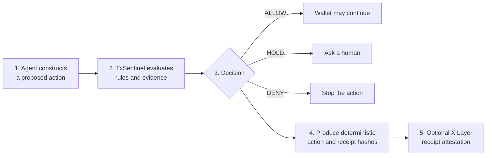
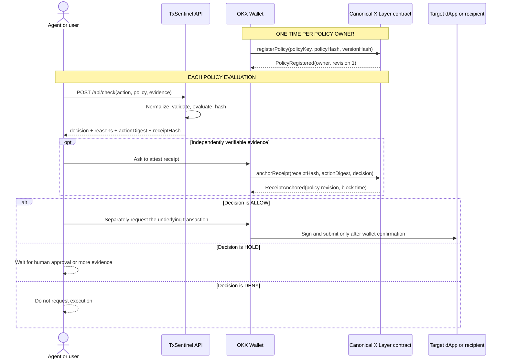
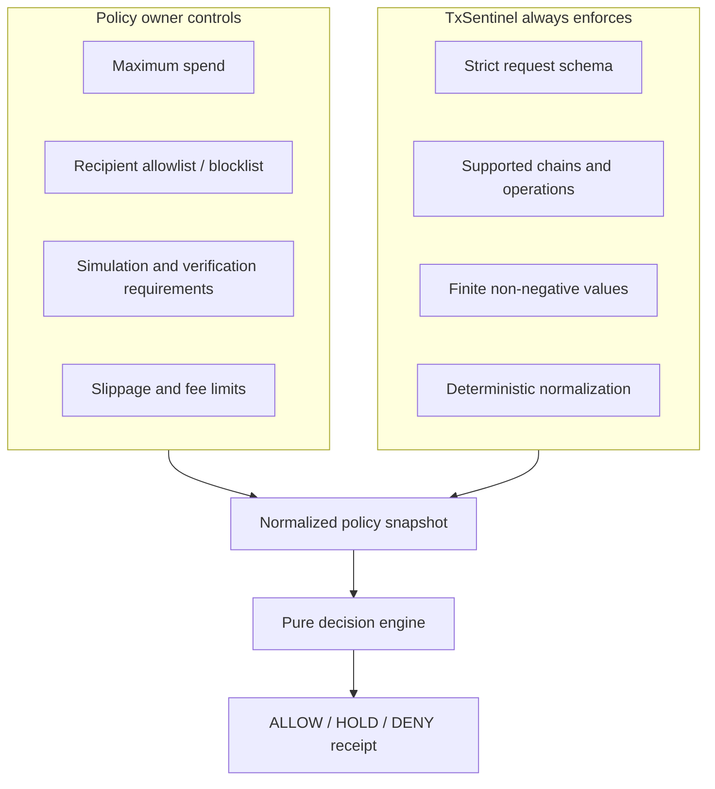
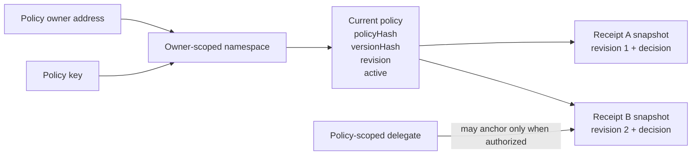
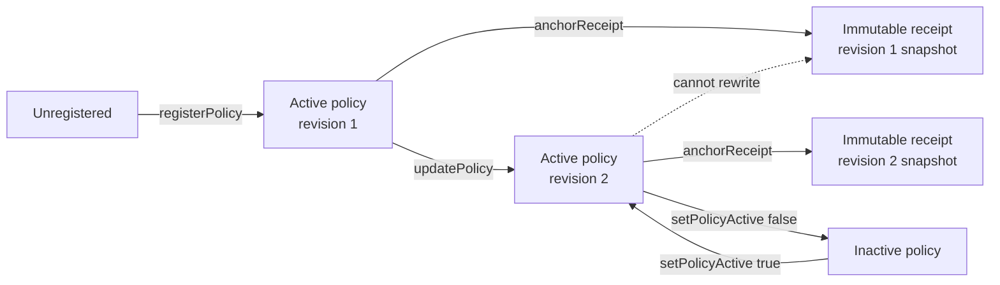
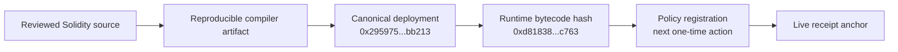
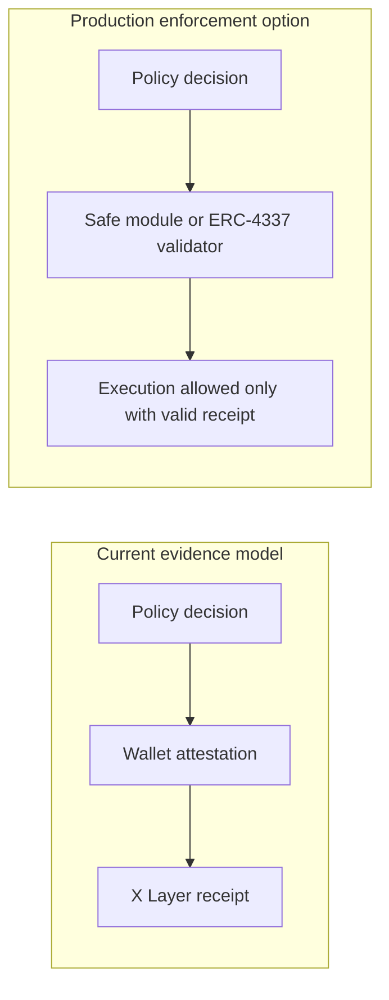

# TxSentinel Visual Guide

This guide explains where a policy check starts, what OKX Wallet signs, and exactly what X Layer
stores. It describes the implemented hackathon build; future enforcement modules are labeled
separately.

## 1. The 30-Second Mental Model

The trigger is the moment after the agent knows what it wants to do but before a wallet signs the
underlying transaction. TxSentinel never receives a private key and cannot broadcast that action.

## 2. One-Time Setup and Per-Action Flow

The receipt-attestation transaction and the underlying asset transaction are deliberately separate.
The current contract proves that an address attested to a decision; it does not enforce execution.

## 3. Who Defines the Rules?

The user chooses risk appetite; TxSentinel owns the validation and determinism rules that prevent an
agent from silently changing the meaning of the request.

### Canonical hackathon Policy v1

| Rule | Value |
| --- | ---: |
| Maximum spend | 100 USD |
| Unlimited approvals | Denied |
| Simulation evidence | Required |
| Maximum slippage | 100 bps |
| Maximum estimated fee | 5 USD |
| Verified contract | Not required in v1 |

## 4. What the X Layer Contract Stores

Each receipt copies the exact policy hash, version hash, and revision active at anchor time. Updating
the policy cannot rewrite historical evidence. Receipt uniqueness is scoped to the policy owner and
policy key, preventing unrelated accounts from occupying another owner's receipt namespace.

## 5. Policy Lifecycle

Registration is once per `owner + policyKey`. Rule changes use `updatePolicy` rather than deploying a
new contract. An inactive policy fails closed and cannot accept new receipt anchors.

## 6. Trust Boundary

| Component | Can do | Cannot do |
| --- | --- | --- |
| TxSentinel API | Validate proposals, evaluate policy, produce deterministic hashes | Read a private key, sign, or broadcast |
| OKX Wallet | Show and sign explicit user-approved transactions | Change the reviewed contract bytecode |
| X Layer anchor | Store policy versions and immutable receipt snapshots | Hold assets, approve tokens, call target contracts, or execute the proposed action |
| Agent | Propose actions and react to decisions | Bypass wallet confirmation through TxSentinel |

## 7. Current Onchain Evidence

- [Canonical X Layer Testnet contract](https://www.okx.com/web3/explorer/xlayer-test/address/0x295975cbec1673061d11c223b35a8513d1ebb213)
- [Deployment transaction](https://www.okx.com/web3/explorer/xlayer-test/tx/0x6604803fda9b0b298ed18ea1e3e9dfc4b58b05e0f2989652f64500e8aa741ae9)
- [Security review](../SECURITY_REVIEW.md)
- [Contract source](../contracts/TxSentinelPolicyAnchor.sol)

## 8. Current vs. Future Enforcement

The future module is a documented replacement point, not a claim about the current build.
