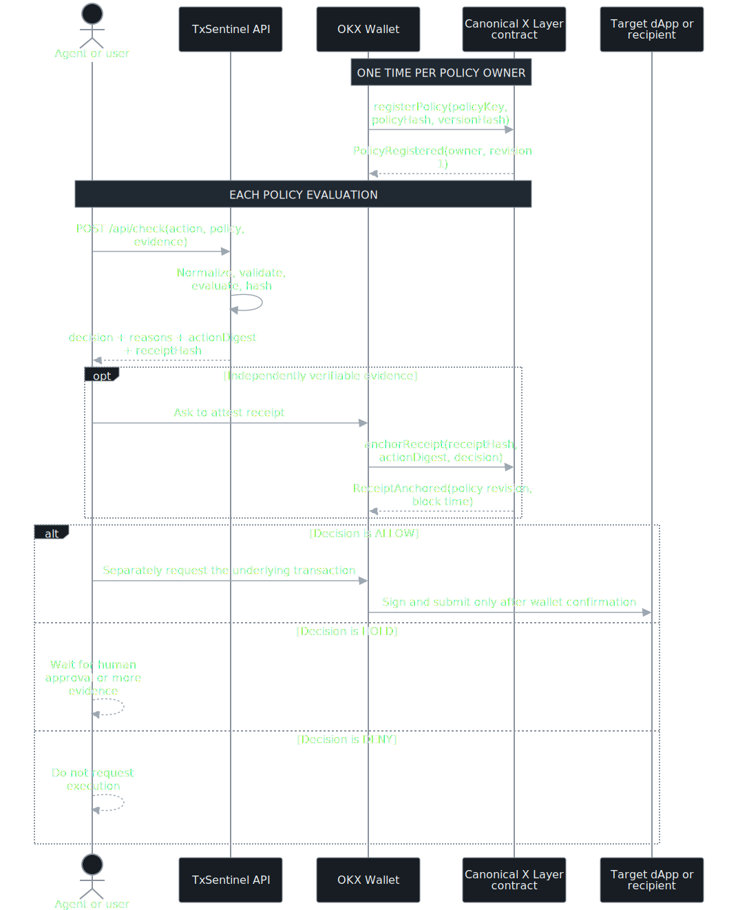

# TxSentinel Visual Guide

This guide explains where a policy check starts, what OKX Wallet signs, and exactly what X Layer
stores. It describes the implemented hackathon build; future enforcement modules are labeled
separately.

## 1. The 30-Second Mental Model

The trigger is the moment after the agent knows what it wants to do but before a wallet signs the
underlying transaction. Free preflight applies a basic subset and exposes only coarse readiness;
`READY` is not equivalent to `ALLOW`. The formal paid route evaluates the complete policy and exposes
the detailed deterministic receipt. TxSentinel never receives a private key and cannot broadcast.

## 2. One-Time Setup and Per-Action Flow

Input validation and policy computation happen offchain before the x402 payment challenge. The
receipt-attestation transaction and the underlying asset transaction are deliberately separate.
The current contract proves that an address attested to a paid formal decision; it does not enforce execution.

## 3. Who Defines the Rules?

The user chooses risk appetite; TxSentinel owns the validation and determinism rules that prevent an
agent from silently changing the meaning of the request.

### Canonical hackathon Policy v1

| Rule | Value |
| --- | ---: |
| Maximum spend | 100 USD |
| Unlimited approvals | Denied |
| Simulation evidence | Required |
| Maximum slippage | 100 bps |
| Maximum estimated fee | 5 USD |
| Verified contract | Not required in v1 |

## 4. What the X Layer Contract Stores

Each receipt copies the exact policy hash, version hash, and revision active at anchor time. Updating
the policy cannot rewrite historical evidence. Receipt uniqueness is scoped to the policy owner and
policy key, preventing unrelated accounts from occupying another owner's receipt namespace.

## 5. Policy Lifecycle

Registration is once per `owner + policyKey`. Rule changes use `updatePolicy` rather than deploying a
new contract. An inactive policy fails closed and cannot accept new receipt anchors.

## 6. Trust Boundary

The x402 service payment and the protected action are separate. The seller sets the service price,
receiving address, and accepted assets on the server. The buyer chooses one advertised asset and
explicitly approves or rejects those terms. Separately, the buyer's agent supplies the proposed
action destination and amount that TxSentinel evaluates. Allowing the buyer to rewrite the x402
price or recipient would let it bypass payment, so those fields are intentionally read-only in the
buyer flow.

| Component | Can do | Cannot do |
| --- | --- | --- |
| Free preflight | Apply basic readiness checks and return READY, REVIEW, or BLOCKED | Return formal evidence, digest, receipt hash, or authorization to execute |
| Formal x402 API | Validate before payment, then return detailed decision and stable hashes after settlement | Read a private key, sign, or broadcast |
| OKX Wallet | Show and sign explicit user-approved transactions | Change the reviewed contract bytecode |
| X Layer anchor | Store policy versions and immutable receipt snapshots | Hold assets, approve tokens, call target contracts, or execute the proposed action |
| Agent | Propose actions and react to decisions | Bypass wallet confirmation through TxSentinel |

## 7. End-to-End Role Interaction

This sequence joins seller configuration, free readiness, prepayment validation, OKX Wallet
approval, official facilitator settlement, X Layer transfer, and the formal policy response. Free
preflight is steps 3–4. The service payment settles in steps 12–13. The optional paid-receipt anchor
in steps 16–17 is a separate evidence transaction and never executes the protected action.

## 8. Current Onchain Evidence

- [Canonical X Layer Testnet contract](https://www.okx.com/web3/explorer/xlayer-test/address/0x295975cbec1673061d11c223b35a8513d1ebb213)
- [Deployment transaction](https://www.okx.com/web3/explorer/xlayer-test/tx/0x6604803fda9b0b298ed18ea1e3e9dfc4b58b05e0f2989652f64500e8aa741ae9)
- [Security review](../SECURITY_REVIEW.md)
- [Contract source](../contracts/TxSentinelPolicyAnchor.sol)

## 9. Current vs. Future Enforcement

The future module is a documented replacement point, not a claim about the current build.
